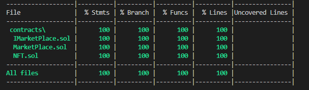

# NFT Marketplace Limeblock

This project demonstrates an advanced Hardhat use case, integrating other tools commonly used alongside Hardhat in the ecosystem.

The goal of this project is to create an NFT marketplace. The NFT marketplace should allow users to create, view, and trade their NFTs. In the NFT marketplace, the users should be able to create collections and mint NFTs from these collections. The users should also be able to see their profile (or that of another user denoted by their address). Any owner should be able to list their NFT or make an offer to buy an NFT to another user.

# Test coverage
   

# Before deployment
  1. Install all packages

  ```Example
    npm install
  ```
2. Set the environment variable of the account in `.env` file. The owner wallet private key could be obtained from `hardhat` accounts or Metamask

```Example
  WALLET_PRIVATE_KEY=// The account wallet private key
```

# Live Deployment
  1. Log In or Register at https://infura.io/.
  2. Set the Rinkeby or Ropsten environment variables in `.env` file
```Example
  ROPSTEN_URL=https://ropsten.infura.io/v3/<INFURA_ID>
  RINKEBY_URL=https://rinkeby.infura.io/v3<INFURA_ID>
  WALLET_PRIVATE_KEY=// The account wallet private key from Metamask
  ETHERSCAN_API_KEY=// Optional
```
  3. Compile the contracts
```Example
  npx hardhat compile
```
  4. Deploy Contracts on Rinkeby/Ropsten
```Example
  npx hardhat run --network rinkeby/ropsten ./scripts/deploy.ts
```
  5. Check the console. The output should be:
```Example
  NFT deployed to: 0x...
  MarketPlace deployed to: 0x...
```
  6. Add the contracts addresses after being deployed to the `.env` file in order to start the project.
```Example
  REACT_APP_NFT_ADDRESS=// Copy from the console and paste it here
  REACT_APP_MARKET_PLACE_ADDRESS=// Copy from the console and paste it here
```

**Optional: Verify contracts deployment**
- Add `ETHERSCAN_API_KEY` in `.env` file
- Verify deployment:
```Example
  npx hardhat verify --network rinkeby/ropsten <NFT_ADDRESS> <MARKET_ADDRESS>
```

  7. Start the React app
```Example
  npm run start
```

# Development
  1. Start hardhat node
```Example
  npx hardhat node
```
  2. Write down the the private key from the first account from the console in order to use it later in the steps
```Example
Private Key: 0x...
```

  2. Deploy Contracts on localhost
```Example
  npx hardhat run --network localhost ./scripts/deploy.ts
```

  3. Check the console. The output should be
```Example
  NFT deployed to: 0x...
  MarketPlace deployed to: 0x...
```

  4. Add the contracts addresses after being deployed to the `.env` file in order to start the project.
```Example
  REACT_APP_NFT_ADDRESS=// Copy from the console and paste it here
  REACT_APP_MARKET_PLACE_ADDRESS=// Copy from the console and paste it here
```
  5. Start the React App
```Example
  npm run start
```

  6. [Import the account in Metamask](https://metamask.zendesk.com/hc/en-us/articles/360015489331-How-to-import-an-Account) with private key from `npx hardhat node` command.

  7. [Add the network to Metamask](https://metamask.zendesk.com/hc/en-us/articles/360043227612-How-to-add-a-custom-network-RPC) for Hardhat localhost:8545.

# Bonus
- If you get error `Nonce too high` in the browser - reset [Metamask Account](https://medium.com/@thelasthash/solved-nonce-too-high-error-with-metamask-and-hardhat-adc66f092cd)

